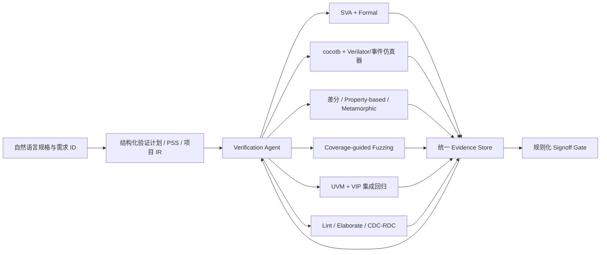

# 面向 Agentic IC 的芯片验证方法调研报告

**版本：** v1.0
**日期：** 2026-07-17
**范围：** 数字 IC/RTL 的前硅功能验证，重点讨论 AI Agent 作为验证执行主体时的方法、工具接口与 Signoff 边界
**结论状态：** 调研建议；不替代具体项目的验证计划、EDA 工具认证或签核流程

---

## 摘要

UVM 的核心价值是标准化、复用和跨工具互操作，而不是为自主 Agent 提供最短的推理—执行—反馈闭环。Accellera 对 UVM 的定位明确强调模块化、可扩展、可复用的验证环境以及验证组件的互操作性 [S01]。因此，将 UVM 简单描述为“只给人类工程师使用”并不准确；但从 Agent 的工作特征看，UVM 中的 factory、configuration database、phase、objection、virtual sequence、宏和跨层继承会形成大量动态或隐式上下文，仿真结果又经常以长日志、波形和 coverage database 呈现。这些特征确实增加了 Agent 的理解、修改和故障定位成本。此处关于“Agent 摩擦”的判断是基于 UVM 结构和现有 LLM 验证实验作出的工程推断，而不是 UVM 标准本身的结论。

调研没有发现一种已经成熟、可以独立替代 UVM 的“Agentic IC Verification Methodology”。现有证据更支持一种**多引擎、验证器落地（verifier-grounded）的混合方法**：Agent 负责理解规格、规划任务、生成候选测试/属性、调度工具、分析覆盖率和缩减反例；仿真器、形式验证器、断言、可信参考模型及等价性检查负责判定真伪。UVM 保留在协议 VIP、复杂集成场景、SoC 回归及最终 Signoff 层。

推荐架构可概括为：

> **UVM 作为集成与签核后端；PSS/结构化验证计划作为场景描述层；Formal、cocotb/Verilator、差分验证、性质测试和硬件 Fuzzing 作为 Agent 原生验证内核；UCIS/统一 Evidence Store 作为反馈与审计层。**

---

## 1. 调研问题与边界

本报告回答以下问题：

1. UVM 是否不适合 Agent 进行芯片验证？
2. 有哪些比“直接让 Agent 编写整套 UVM”更适合 Agent 的方法？
3. 硬件 Fuzzing、形式验证、差分验证、性质测试和 Portable Stimulus 应如何组合？
4. Agent 能否成为验证结果的最终判定者？
5. 对已有 Func Model 和 RTL 的 NPU 项目，推荐怎样落地？

不在本报告范围内的内容包括模拟/混合信号验证、物理验证、DFT、硅后量产测试，以及特定商业 EDA 产品之间的采购比较。

### 1.1 证据分级

为避免把论文原型误写成成熟工程能力，报告采用以下证据等级：

| 等级 | 定义 | 使用方式 |
|---|---|---|
| A | 标准组织或工具官方文档 | 可作为标准/工具能力依据 |
| B | 已发表的同行评审会议或期刊论文 | 可作为方法有效性的实验依据，但仍需评估外部有效性 |
| C | arXiv/OpenReview 等预印本或研究原型 | 用于判断研究趋势，不直接视为生产成熟度证明 |
| D | 基于上述资料形成的工程推断 | 必须通过项目试点校准 |

---

## 2. 对 UVM 的重新定位

### 2.1 UVM 不应被整体否定

UVM 的公开目标是建立标准化、模块化、可扩展、可复用的验证环境，降低不同项目或 EDA 工具之间重复采购和重写验证 IP 的成本 [S01]。IEEE 1800.2 对应的 UVM 2020 参考实现仍在由 Accellera 维护 [S01]。在以下场景中，UVM 具有难以替代的工程价值：

- AXI、PCIe、DDR 等成熟协议 VIP；
- Register Abstraction Layer（RAL）；
- 多 Agent、多接口和复杂虚拟序列；
- SoC 级 constrained-random regression；
- 商业仿真、加速器和仿真器生态；
- 已积累的大量验证资产和团队经验。

### 2.2 UVM 对自主 Agent 的主要摩擦

以下为工程推断（证据等级 D）：

- **隐式状态多：** factory override、`config_db`、phase 和 objection 使实际行为分散在多个类和生命周期中。
- **局部性较差：** 一个 sequence 或 monitor 的修改可能依赖 package、factory、virtual interface 和 environment 配置。
- **反馈不够紧凑：** 失败经常表现为长日志或长波形，而不是小型、结构化反例。
- **验证环境自身也可能错误：** Agent 即使生成了可编译、可运行、coverage 较高的 UVM，也不能说明 scoreboard、constraint 或 coverage model 正确。
- **工具闭环偏长：** 复杂编译、elaboration 和仿真降低 Agent 的试错吞吐量。

VerifLLMBench 对 LLM 生成 UVM testbench 的评测表明，即使在相对简单的 DUT 上，也需要语法修正、lint 和 coverage 分析；论文明确指出生成健壮、高功能覆盖率 UVM testbench 仍存在明显缺口 [S19]。另一方面，UVM² 和 UVMarvel 等研究表明，Agent 可以在结构化 IR、协议库和 coverage feedback 的帮助下自动构建或改进 UVM 环境，但目前评测规模和开放复现程度仍不足以证明其可替代工业 Signoff 流程 [S20][S24]。

### 2.3 推荐定位

不建议采用“UVM 或非 UVM”的二选一策略。推荐：

- Agent 日常内循环不直接依赖完整 UVM 心智模型；
- 通过稳定 CLI/API、PSS 模型或项目自定义 IR 调用 UVM；
- UVM 输出标准化成 JSON/JUnit/UCIS 和可重放 testcase；
- UVM 继续承担协议、系统集成和最终回归职责。

---

## 3. Agent 原生验证方法的设计原则

Agent 友好不等于“使用 Python”。一个方法是否适合 Agent，主要取决于是否具备以下能力：

1. **确定性和可重放：** 固定 RTL commit、工具版本、seed、配置和输入后结果可重复。
2. **机器可调用：** 通过非交互 CLI/API 运行，不依赖 GUI 操作。
3. **结构化结果：** 返回 PASS/FAIL/UNKNOWN/TIMEOUT、coverage delta、失败类别、反例和产物路径。
4. **可信 Oracle：** 正确性由断言、参考模型或形式工具判定，而不是由 LLM 自我评价。
5. **短反馈闭环：** 优先在最小 block、最小状态空间和最短 testcase 上运行。
6. **自动缩减：** 失败后能够最小化 transaction、指令、配置或时序窗口。
7. **可审计：** 需求、属性、测试、coverage、bug 和 RTL 修改之间可追踪。
8. **多工具交叉验证：** 关键结论不依赖单一 Agent 或单一验证引擎。

这些原则与近期研究趋势一致：LLM4DV 使用 coverage 反馈迭代生成刺激 [S16]；FormalRTL 将软件参考模型作为可执行规格并以形式等价检查约束生成结果 [S21]；SpecLoop 则把形式反例反馈给 Agent 迭代修正规格 [S22]。后两项仍是预印本，反映的是方向而非工业成熟度。

---

## 4. 候选方法评估

### 4.1 Python 协同仿真：cocotb + Verilator

cocotb 允许 Python 直接驱动和监测 VHDL/SystemVerilog DUT，并支持标准化、机器可读的测试报告；官方文档还强调修改 Python 测试通常不需要重新编译设计 [S04]。Verilator 将 Verilog/SystemVerilog 编译为可执行 C++/SystemC 模型，并支持 waveform 及 property、covergroup、FSM、line、toggle 等 coverage [S05]。

**适合：**

- Block/IP 单元验证；
- 数据通路 bit-exact 对比；
- Agent 高频生成和执行测试；
- Python Func Model、NumPy/PyTorch 参考模型集成；
- pytest/JUnit/CI 集成。

**限制：**

- cocotb 是驱动与观测接口，不是自动提供完整验证方法；
- 验证计划、scoreboard、coverage model 和 oracle 仍需设计；
- 商业 VIP 和大型 SoC UVM 资产不能自动迁移；
- Verilator 对全部 SystemVerilog/UVM 动态特性的覆盖与事件仿真器不同，必须按 DUT 特性验证兼容性。

**结论：** 非常适合作为 Agent 的 block 级动态验证内核，但不能单独承担 SoC Signoff。

### 4.2 Assertion-Based Verification 与形式验证

SymbiYosys（SBY）官方支持安全属性的有界/无界验证、cover trace 生成和活性属性验证 [S06]。形式验证的核心优势是：对给定假设和属性，工具可以给出证明、反例或未完成状态；反例通常比超长随机回归波形更紧凑，适合作为 Agent 的反馈。

**适合：**

- FIFO overflow/underflow；
- handshake 稳定性；
- 仲裁互斥与最终响应；
- DMA 数据不丢失、不重复；
- Cache 状态不变量；
- reset/flush/interrupt 边界；
- 死锁、活锁和安全隔离属性。

**主要风险：**

- 错误属性可能证明错误规格；
- 约束过强可能导致 vacuous pass；
- 约束过弱会造成不真实反例；
- 大状态空间可能超时。

通用 LLM 生成 assertion 的成熟度仍有限。一项针对 assertion 生成的系统研究指出，通用现成 LLM 会产生相当比例的语法或语义错误，尚不适合直接生产采用 [S18]。AssertLLM 报告在一个完整设计上有 89% 的生成 assertion 同时满足语法和功能正确性，但测试对象和规模仍有限 [S17]。因此，Agent 生成的属性必须依次通过：编译、形式检查、可达性/vacuity 检查、mutation test 和需求人工审阅。

2026 年发布的 AssertLLM2 预印本进一步把 assertion 生成的评价拆为语法有效性、形式可证明性、coverage 和基于缺陷 RTL/mutation 的 bug 检出能力，并覆盖 83 个设计、13 个功能类别 [S23]。这种评价框架比只统计“生成成功率”更接近实际验证质量，但其预印本身份意味着结果仍需独立复现。

### 4.3 差分验证与可执行参考模型

差分验证对同一输入运行 RTL 和独立参考模型，并比较架构可见输出、状态或 transaction。DIFUZZRTL、TheHuzz 等处理器 fuzzing 工作都使用差分或 golden-reference 思路发现 CPU RTL 错误 [S11][S12]。

**适合：**

- NPU 算子和量化数据通路；
- ISA、microcode 或 command processor；
- DMA 搬运结果；
- 不同 engine、旧版 RTL 与新版 RTL 的行为比较。

**关键要求：**

- 参考模型必须独立实现，避免与 RTL 共享同一错误；
- 明确 bit-accurate、cycle-accurate 或 transaction-accurate 的比较边界；
- 对舍入、饱和、NaN、异常和未定义行为有明确规则；
- 当 RTL 与模型不一致时，不能默认 RTL 错误，也要审计 reference model。

FormalRTL 进一步展示了把软件参考模型用作可执行规格，并通过形式等价检查约束 RTL 生成的研究方向 [S21]。由于该工作属于 2026 年预印本，本报告只把它作为方法趋势证据。

### 4.4 Property-Based Testing 与 Metamorphic Testing

Property-based testing 不是枚举人工 testcase，而是定义输入域和应恒成立的性质，由工具生成大量边界样例并在失败时缩减反例。Hypothesis 官方定义即为：描述输入范围和应对所有输入成立的性质，由框架选择包括意外边界在内的输入 [S09]。

适合硬件的性质包括：

- encode/decode round trip；
- 合法 descriptor 执行前后资源计数守恒；
- 在规定条件下，分块计算与未分块参考结果一致；
- 添加无效 transaction 不改变架构可见状态；
- back-pressure 只改变时序，不改变最终数据；
- 两个明确等价的配置产生一致结果。

Metamorphic testing 在缺少完整 golden output 时尤其有用，但所有变换关系必须考虑定点舍入、累加顺序和非结合性，不能由 Agent 凭常识直接假设。

### 4.5 Coverage-Guided Hardware Fuzzing

硬件 fuzzing 是一种反馈驱动的动态验证：生成或变异输入，运行 RTL/仿真模型，收集覆盖率或微架构状态反馈，保留能够探索新状态的输入，并通过 assertion 或参考模型判错。它与普通 constrained-random 的关键区别是，后续输入会受前面 coverage 结果引导。

公开研究已给出较强实证：

- RFUZZ 将 coverage-guided mutation fuzzing 应用于 RTL/FPGA 验证 [S10]；
- DIFUZZRTL 使用微架构状态指导差分 CPU fuzzing [S11]；
- TheHuzz 在四个开源处理器上发现 11 个 bug，其中 8 个为新 bug，并使用 golden-reference model 判错 [S12]；
- ProcessorFuzz 使用 CSR transition coverage 改善处理器 fuzzing 指导信号 [S14]；
- HyPFuzz 结合形式验证与 fuzzing，发现 3 个此前广泛 fuzzing 和形式验证均遗漏的新漏洞，并报告 coverage 达成速度相对基线提高 11.68 倍 [S13]；
- Cascade 通过生成复杂、有效且相互依赖的 RISC-V 程序，在 5 个 CPU 上发现 37 个新 bug，并提供自动 testcase pruning [S15]。

**对 NPU 更适合 fuzz 的对象：** command、descriptor、microcode、shape/stride/padding、DMA 边界、Weight Cache 状态、多 engine 并发、AXI back-pressure、reset/interrupt/error 的时序组合。

**限制：** fuzzing 能发现 bug，但不能证明没有 bug；coverage 指标选择错误时，fuzzer 可能只优化“容易增加但无功能价值”的覆盖率。

### 4.6 Formal Equivalence Checking

YosysHQ EQY 是面向形式硬件等价检查的前端，官方用例包括验证综合没有引入功能变化，以及验证 RTL 重构在所有条件下保持正确性 [S07]。

**适合：**

- 流水线或组合逻辑重构；
- 综合前后检查；
- 参数化优化；
- Agent 自动修复 RTL 后检查是否破坏既有功能；
- 两种已定义为等价的 engine 实现比较。

**限制：** 等价检查只能证明选定观察边界和假设下的等价；如果 golden design 本身错误，等价检查会保留错误。

### 4.7 Mutation Testing：验证“测试是否真的会抓 bug”

传统 code/toggle/FSM coverage 说明代码是否被执行，不直接说明测试能否识别错误。MCY 会在设计中生成大量突变，并使用形式等价过滤掉不影响重要输出的突变，再检查 testbench 是否能捕获剩余有效突变 [S08]。

Mutation testing 对 Agent 特别重要，因为它可以识别以下伪进展：

- Agent 生成了大量测试，但没有有效检查；
- scoreboard 与 DUT 使用同一错误算法；
- assertion 永远不触发或前提不可达；
- coverage 很高，但关键错误仍无法检测。

因此，mutation score 应作为 Agent 生成测试/属性的质量指标，而不只是统计测试数量或 coverage 百分比。

### 4.8 Portable Stimulus Standard 与 UCIS

Accellera PSS 3.0 定义了单一的刺激和测试场景表示，可在不同集成层次与配置中供不同用户使用 [S02]。PSS 自身不是仿真器或正确性 oracle，但其声明式 action、资源和场景图适合作为从需求到具体 cocotb、C test 或 UVM sequence 的中间表示。这里“适合 Agent IR”是工程推断（等级 D），不是 PSS 标准宣称的 AI 功能。

UCIS 则定义跨工具访问、交换和合并 coverage 数据的标准接口与 XML 交换格式，支持跨 run、跨 design part 以及异构验证过程的数据组织 [S03]。对于 Agentic 验证，UCIS 或受其启发的统一 coverage schema 可以避免 Agent 为每个仿真器解析不同文本报告。

---

## 5. 研究证据对 Agent 能力的启示

| 研究/标准 | 主要结果 | 对本报告的启示 | 证据等级 |
|---|---|---|---|
| UVM / IEEE 1800.2 [S01] | 标准化、复用、互操作 | 保留 UVM 资产，不宜整体废弃 | A |
| PSS 3.0 [S02] | 跨层次场景的单一表示 | 可作为 Agent 场景 IR，但需项目试点 | A + D |
| UCIS 1.0 [S03] | 跨工具 coverage API/交换 | 统一 Agent coverage 数据层 | A |
| LLM4DV [S16] | 其早期 arXiv 实验中，简单 Prefetcher 最高 98.94%，Ibex Decoder 86.19%，完整 Ibex CPU 仅 5.61% coverage | LLM 在复杂 DUT 上明显退化，必须分层和工具反馈 | B |
| VerifLLMBench [S19] | 展示 LLM 生成 UVM TB 的 build、lint 和 coverage 缺口 | “能生成 UVM”不等于健壮验证 | B |
| AssertionLLM 研究 [S18] | 通用 LLM 生成 assertion 尚未达到直接生产采用水平 | 属性必须由形式工具、mutation 和审阅验证 | C |
| UVM² [S20] | coverage feedback 可迭代改进自动生成 UVM | UVM 可成为 Agent 后端，但结果仍需独立复现 | C |
| RFUZZ/TheHuzz/HyPFuzz/Cascade [S10][S12][S13][S15] | fuzzing、golden model、formal hybrid 和 testcase pruning 均发现真实处理器 bug | fuzzing 是有实证的 Agent 友好探索引擎 | B |
| FormalRTL/SpecLoop [S21][S22] | 可执行规格、等价检查和形式反例反馈改善 Agent 闭环 | verifier-grounded agent 是重要研究方向 | C |

最重要的共同结论不是“LLM 已经掌握某种验证语言”，而是：**当 Agent 的动作受到 coverage、仿真、形式证明、参考模型和反例的外部约束时，可靠性明显高于纯文本生成。**

---

## 6. 推荐的 Agentic Verification 总体架构



### 6.1 Agent 的职责

- 从规格提取需求和候选性质；
- 将验证目标拆成 block、subsystem 和 SoC 任务；
- 生成候选 SVA、cocotb test、PSS action、fuzz seed 和 constraint；
- 调用工具、解析结构化结果；
- 根据 coverage hole 和反例规划下一次实验；
- 自动缩减、去重和聚类失败；
- 生成 bug track、需求追踪矩阵和回归项；
- 提交 RTL/验证环境候选修复，但不自行宣布 Signoff。

### 6.2 独立验证器的职责

- 仿真器执行 RTL 语义；
- formal engine 给出 proof/counterexample/unknown；
- assertion 和 scoreboard 判定局部性质；
- Func Model/ISA Model 提供独立 oracle；
- equivalence checker 判定重构等价性；
- mutation engine 衡量验证环境的 bug 检出能力。

### 6.3 建议的统一结果格式

每次执行至少保存：

```json
{
  "requirement_id": "REQ-DMA-017",
  "test_or_property_id": "PROP-DMA-NO-DROP-003",
  "rtl_commit": "<git-sha>",
  "tool": "<tool-name>",
  "tool_version": "<version>",
  "seed": 123456,
  "configuration": "<config-hash>",
  "status": "PASS|FAIL|UNKNOWN|TIMEOUT",
  "oracle": "assertion|reference_model|equivalence|timeout",
  "coverage_delta": {},
  "counterexample": "<artifact-path>",
  "waveform": "<artifact-path>",
  "log": "<artifact-path>",
  "bug_id": "<optional>"
}
```

禁止把 `UNKNOWN` 或 `TIMEOUT` 自动折算成 PASS。

---

## 7. 面向 NPU 项目的推荐映射

| NPU 模块/风险 | 首选方法 | 辅助方法 | 主要 Oracle |
|---|---|---|---|
| MAC/MXU、量化、舍入、饱和 | cocotb + 差分验证 | Property-based、mutation | Python/C++ Func Model |
| Vector/activation/normalization | 差分 + metamorphic | 定向边界测试 | Func Model + 明确数值规范 |
| DMA/descriptor | Formal + fuzzing | cocotb、UVM AXI VIP | SVA + memory reference model |
| FIFO/arbiter/scheduler | Formal | constrained-random | 不变量、活性属性 |
| Weight Cache | Formal + stateful property testing | fuzzing | cache reference model + SVA |
| Command processor/microcode | Coverage-guided fuzzing | 差分、formal | architectural/command model |
| 多 engine 并发 | PSS/场景 IR + UVM | fuzzing | transaction scoreboard |
| AXI/DDR/PCIe 集成 | UVM + 商业/成熟 VIP | assertion | VIP protocol checker |
| RTL 优化/重构 | Formal equivalence | regression | golden RTL/明确参考模型 |
| 验证环境质量 | Mutation testing | review、coverage closure | 有效 mutation 检出率 |

对于已有 Func Model 和 RTL 的项目，最有性价比的起点不是训练 UVM 专用大模型，而是把 Func Model 暴露成稳定、bit-accurate 的 oracle API，并让 cocotb/Verilator、fuzzer 和 Agent 共用同一输入/输出 schema。

---

## 8. 分阶段实施路线

### Phase 0：验证基础设施标准化

- 定义 requirement ID、test/property ID 和 bug ID；
- 固定非交互 runner；
- 输出统一 JSON/JUnit 和 artifact manifest；
- 保存 commit、seed、工具版本和配置哈希；
- 区分 PASS、FAIL、UNKNOWN、TIMEOUT 和 INFRA_ERROR。

**退出条件：** 同一 testcase 可由人类和 Agent 重放，结果一致。

### Phase 1：两个 Block 试点

- 选择一个数据通路 block，例如 MXU/quantization；
- 选择一个控制 block，例如 DMA/FIFO/Weight Cache；
- 数据通路使用 Func Model + cocotb + property-based；
- 控制逻辑使用 SVA + formal；
- 引入少量 mutation，验证测试是否有实际检错能力。

**退出条件：** Agent 能从失败结果生成最小可复现用例；人工确认没有把参考模型错误误判为 RTL bug。

### Phase 2：Coverage-Guided Fuzzing

- 为 descriptor/command 定义结构化 grammar；
- 选择功能相关 coverage，而非只使用 line coverage；
- 建立 seed corpus、去重和 testcase minimization；
- 将 formal cover trace 转换为难达状态的 fuzz seed，参考 HyPFuzz 的混合思想 [S13]。

**退出条件：** fuzzing 相对既有 random regression 发现新的状态、coverage hole 或真实 bug；所有发现均可确定性重放。

### Phase 3：UVM/PSS 集成

- 将 Agent 生成的场景映射为 PSS 或项目 IR；
- 由适配器生成/调用 UVM sequence，而不是让 Agent 每次重建 UVM environment；
- 把 UVM coverage 和 failure summary 输出到统一 Evidence Store；
- 保留商业 VIP 和原有 Signoff regression。

**退出条件：** block 级反例能升级为 subsystem/SoC 级回归，且 UVM 资产没有被重复实现。

### Phase 4：受控自治

- Agent 自动做 coverage hole analysis、seed 生成、失败聚类和 bug draft；
- RTL 修复必须通过受保护分支、代码审阅、equivalence/回归；
- Agent 不能修改 Signoff 门槛或将 waiver 自动批准。

---

## 9. 测试与 Signoff 建议

Agentic 验证的 Signoff 对象不仅包括 RTL，也包括 Agent 和验证环境。

### 9.1 RTL Signoff 证据

- 所有需求都有对应 test、property、review 或明确 waiver；
- P0/P1 bug 清零，其他 bug 有风险评估和责任人；
- formal 属性记录 PROVEN/FAILED/UNKNOWN，不隐藏 timeout；
- code、toggle、FSM、functional coverage 达到项目定义目标，并完成 hole review；
- 差分回归覆盖所有受支持数据类型、shape、边界和异常模式；
- fuzz corpus 可重放，长期运行结果去重并纳入 regression；
- UVM/VIP 集成回归通过；
- 重构或综合变换完成适用的 equivalence check。

### 9.2 验证环境 Signoff 证据

- scoreboard/reference model 有独立单元测试；
- assertion 完成 antecedent reachability/vacuity 检查；
- 有效 mutation 的未检出项全部分析，不盲目追求任意百分比；
- Agent 生成测试的 bug-detection mutation score 不低于人工基线；
- runner、parser 和 evidence schema 有回归测试；
- coverage 合并过程可审计，必要时采用 UCIS [S03]。

### 9.3 Agent 自身的评价指标

- 语法有效率；
- 编译/elaboration 成功率；
- 独立 oracle 通过率；
- 每单位仿真或 token 成本带来的 coverage delta；
- mutation 检出率；
- false assertion 和 vacuous assertion 比例；
- 失败缩减比例和重放成功率；
- 重复 bug、错误归因和无效修改比例。

不建议以“生成代码行数”“测试数量”或“Agent 自己判断已完成”作为 Signoff 指标。

---

## 10. 风险与尚未解决的问题

1. **规格歧义：** Agent 可以把自然语言转成形式属性，但无法自行判断架构师未写出的真实意图。
2. **Oracle 污染：** RTL 和 Func Model 若共享同一实现或同一误解，差分验证可能共同通过。
3. **Coverage gaming：** Agent 可能优化易达 coverage，而非高风险功能。
4. **Vacuous proof：** 过强 assumption 可以让错误设计“证明通过”。
5. **状态空间与成本：** formal、长时间 fuzzing 和大型 RTL 仿真都可能产生高计算成本。
6. **商业工具接口：** 开源流程可验证方法，但实际 Signoff 仍可能依赖许可证、VIP 和供应商支持。
7. **研究外推风险：** 多数 LLM/Agent 论文仍基于小型或开源 DUT；UVM²、UVMarvel、FormalRTL、SpecLoop 等结果不能直接外推到大型工业 NPU/SoC [S20][S21][S22][S24]。
8. **安全与变更权限：** Agent 应通过受限工具接口工作，不能自行降低约束、删除失败测试或批准 waiver。

---

## 11. 最终结论

1. **UVM 仍然需要，但不应成为 Agent 的唯一工作界面。** 它最适合继续承担复用、VIP、复杂系统集成和最终回归。
2. **Agentic 验证的核心不是新的单一语言，而是新的控制与证据闭环。** Agent 负责提出和探索，独立工具负责判真。
3. **最优先的技术组合是：**
   - 数据通路：Func Model + cocotb/Verilator + 差分/性质测试；
   - 控制逻辑：SVA + Formal；
   - 长序列和罕见组合：Coverage-Guided Fuzzing；
   - RTL 重构：Formal Equivalence；
   - 验证环境质量：Mutation Testing；
   - 场景复用：PSS/项目 IR；
   - SoC 集成：UVM/VIP。
4. **近期研究最可靠的共同模式是 verifier-grounded loop。** LLM 生成内容必须由 simulator、formal engine、reference model、coverage 和 mutation testing 约束，不能以 LLM 自评作为证据。
5. **对已有 Func Model 和 RTL 的 NPU 项目，建议从两个 block 试点开始，先建立统一 runner、oracle 和 evidence schema，再扩展到 fuzzing 与 UVM 集成。**

---

## 参考文献与资料来源

> 链接核验日期均为 2026-07-17。标准/官方文档标为 **[A]**，同行评审论文标为 **[B]**，预印本/研究原型标为 **[C]**。

**[S01] [A]** Accellera Systems Initiative, “Universal Verification Methodology (UVM) Working Group” and “Download UVM,” including UVM 2020 reference implementations for IEEE 1800.2.
https://www.accellera.org/activities/working-groups/uvm
https://www.accellera.org/downloads/standards/uvm

**[S02] [A]** Accellera Systems Initiative, *Portable Test and Stimulus Standard 3.0 Language Reference Manual*, 2024-08-28.
https://www.accellera.org/downloads/standards/portable-stimulus

**[S03] [A]** Accellera Systems Initiative, *Unified Coverage Interoperability Standard (UCIS) Version 1.0*, 2012.
https://www.accellera.org/downloads/standards/ucis
https://accellera.org/images/downloads/standards/ucis/UCIS_Version_1.0_Final_June-2012.pdf

**[S04] [A]** cocotb Project, “Welcome to cocotb’s Documentation,” cocotb 2.0.1 documentation.
https://docs.cocotb.org/

**[S05] [A]** Verilator Project, “Overview” and “Coverage Analysis,” Verilator User’s Guide.
https://verilator.org/guide/latest/overview.html
https://verilator.org/guide/latest/simulating.html#coverage-analysis

**[S06] [A]** YosysHQ, “SymbiYosys (sby) Documentation.”
https://yosyshq.readthedocs.io/projects/sby/en/latest/

**[S07] [A]** YosysHQ, “Equivalence Checking with Yosys (EQY) Documentation.”
https://yosyshq.readthedocs.io/projects/eqy/en/stable/
https://yosyshq.readthedocs.io/projects/eqy/en/latest/quickstart.html

**[S08] [A]** YosysHQ, “Mutation Cover with Yosys (MCY) Documentation” and “Methodology.”
https://mcy.readthedocs.io/en/stable/index.html
https://yosyshq.readthedocs.io/projects/mcy/en/latest/methodology.html

**[S09] [A]** Hypothesis Project, “Hypothesis Documentation: Property-Based Testing for Python.”
https://hypothesis.readthedocs.io/en/latest/

**[S10] [B]** K. Laeufer, J. Koenig, D. Kim, J. Bachrach, and K. Sen, “RFUZZ: Coverage-Directed Fuzz Testing of RTL on FPGAs,” *ICCAD 2018*.
https://people.eecs.berkeley.edu/~ksen/papers/rfuzz.pdf
https://doi.org/10.1145/3240765.3240842

**[S11] [B]** J. Hur et al., “DifuzzRTL: Differential Fuzz Testing to Find CPU Bugs,” *2021 IEEE Symposium on Security and Privacy*, pp. 1286–1303, 2021.
https://doi.org/10.1109/SP40001.2021.00103

**[S12] [B]** R. Kande et al., “TheHuzz: Instruction Fuzzing of Processors Using Golden-Reference Models for Finding Software-Exploitable Vulnerabilities,” *31st USENIX Security Symposium*, pp. 3219–3236, 2022.
https://www.usenix.org/conference/usenixsecurity22/presentation/kande

**[S13] [B]** C. Chen et al., “HyPFuzz: Formal-Assisted Processor Fuzzing,” *32nd USENIX Security Symposium*, pp. 1361–1378, 2023.
https://www.usenix.org/conference/usenixsecurity23/presentation/chen-chen

**[S14] [B]** S. Canakci et al., “ProcessorFuzz: Processor Fuzzing with Control and Status Registers Guidance,” *IEEE International Symposium on Hardware Oriented Security and Trust (HOST)*, 2023.
https://doi.org/10.1109/HOST55118.2023.10133714
https://arxiv.org/abs/2209.01789

**[S15] [B]** F. Solt, K. Ceesay-Seitz, and K. Razavi, “Cascade: CPU Fuzzing via Intricate Program Generation,” *33rd USENIX Security Symposium*, pp. 5341–5358, 2024.
https://www.usenix.org/conference/usenixsecurity24/presentation/solt

**[S16] [B]** Z. Zhang et al., “LLM4DV: Using Large Language Models for Hardware Test Stimuli Generation,” *FCCM 2025*, pp. 133–137.
https://doi.org/10.1109/FCCM62733.2025.00048
https://arxiv.org/abs/2310.04535

**[S17] [B]** Z. Yan et al., “AssertLLM: Generating Hardware Verification Assertions from Design Specifications via Multi-LLMs,” *ASP-DAC 2025*, pp. 614–619; earlier methodology and evaluation version published as arXiv:2402.00386.
https://arxiv.org/abs/2402.00386
https://zhiyaoxie.com/files/ASPDAC25_AssertLLM.pdf

**[S18] [C]** V. Pulavarthi, D. Nandal, S. Dan, and D. Pal, “Are LLMs Ready for Practical Adoption for Assertion Generation?” arXiv:2502.20633, 2025.
https://arxiv.org/abs/2502.20633

**[S19] [B]** N. S. Murthy, E. Nelson, S. S. Sapatnekar, and J. Sartori, “VerifLLMBench: An Open-Source Benchmark for Testbenches Generated with Large Language Models,” *DVCon U.S. 2025*.
https://dvcon-proceedings.org/document/verifllmbench-an-open-source-benchmark-for-testbenches-generated-with-large-language-models/
https://people.ece.umn.edu/users/jsartori/papers/dvcon25.pdf

**[S20] [C]** J. Ye et al., “From Concept to Practice: an Automated LLM-aided UVM Machine for RTL Verification,” arXiv:2504.19959, 2025.
https://arxiv.org/abs/2504.19959

**[S21] [C]** K. Li et al., “FormalRTL: Verified RTL Synthesis at Scale,” arXiv:2603.08738, 2026.
https://arxiv.org/abs/2603.08738

**[S22] [C]** F.-C. Chang et al., “SpecLoop: An Agentic RTL-to-Specification Framework with Formal Verification Feedback Loop,” arXiv:2603.02895, 2026.
https://arxiv.org/abs/2603.02895

**[S23] [C]** Y. Wu et al., “AssertLLM2: A Comprehensive LLM Benchmark for Assertion Generation from Design Specifications,” arXiv:2605.27472, 2026.
https://arxiv.org/abs/2605.27472

**[S24] [C]** J. Ye et al., “UVMarvel: an Automated LLM-aided UVM Machine for Subsystem-level RTL Verification,” arXiv:2605.04704, 2026.
https://arxiv.org/abs/2605.04704
