# CV Inference Gantt Timeline — MobileNetV3-Small

**Inference Time = 823.2 μs** | **1215 FPS** | **Block Engine 64×64, INT4 @ 1GHz** | **LPDDR5-6400** | **124 layers (54 GEMM + 70 Non-GEMM)**

Two Mermaid charts corresponding to the two panels in [`cv_gantt.png`](cv_gantt.png):
- **Chart 0** = PNG Panel 1 (宏观 Full Inference, 0 → 823μs, multi-module)
- **Chart A1** = PNG Panel 2 (微观 First 8 GEMMs, 0 → 250μs)

---

## Chart 0: Full MobileNetV3 Inference — Multi-Module Macro (μs)

From RISC-V layer dispatch to final classifier output. 54 GEMM layers interleaved with 70 non-GEMM
layers (batchnorm, h-swish, pooling). Since individual GEMMs are too numerous to label, they are
grouped into architectural phases.

```mermaid
gantt
    title MobileNetV3-Small, Block 64x64, INT4 @ 1GHz (μs)
    dateFormat x
    axisFormat %S

    section RISC-V / KV
    Early layer dispatch+switch         :active, 0, 120
    Mid-depthwise dispatch+switch       :active, 120, 380
    Late bottleneck dispatch+switch     :active, 380, 620
    Classifier + final dispatch         :active, 620, 781
    DRAM refresh                        :done, 781, 823

    section MXU Compute
    Early Convs (layers 1–6)            :crit, 0, 120
    Middle DW+PW (layers 7–25)          :crit, 120, 380
    Late Bottlenecks (layers 26–40)     :crit, 380, 620
    Final Conv + Classifier (42–123)    :crit, 620, 781
    (dram_refresh stall)                :milestone, 781, 823

    section DMA (background)
    Weight preload (697K cycles, hidden):active, 0, 820

    section NoC (background)
    NoC latency (948K cycles, hidden)   :active, 0, 820

    section Result
    Classifier output ready             :milestone, 781, 781
    Inference complete                  :milestone, 823, 823
```

> **模块级宏观视图**: MXU 主导关键路径 (697K cycles, 84.7%)。DMA weight preload (691K cycles) 和 NoC latency (948K cycles) 均隐藏在 MXU 计算之后。KV Cache 层切换开销 (84K cycles, 10.2%) 在 124 层之间累积。CV 模型无 SFU/Vector 使用 (已融合进 im2col→GEMM 流程)。末尾 DRAM refresh (42μs) 将总时间推至 823.2μs。

---

## Chart A1: Microscopic — First 8 GEMMs (μs)

Duration: ~250 μs wall-clock. Shows the initial conv layers where MXU times vary drastically
(0.1μs for tiny 1×16×8 convs up to 101.5μs for the largest depthwise layer).

```mermaid
gantt
    title MobileNetV3-Small — First 8 GEMMs (μs)
    dateFormat x
    axisFormat %S

    section RISC-V / KV
    dispatch layer 1            :done, 0, 2
    dispatch layer 2            :done, 21, 22
    dispatch layer 3            :done, 96, 98
    dispatch layer 4            :done, 170, 171
    dispatch layer 5            :done, 210, 211
    dispatch layer 6            :done, 211, 213
    dispatch layer 7            :done, 214, 215
    dispatch layer 8            :done, 230, 231

    section KV layer_switch
    L1→L2 switch (1.5μs)        :milestone, 20, 21
    L2→L3 switch (1.5μs)        :milestone, 95, 96
    L3→L4 switch (1.5μs)        :milestone, 169, 170
    L4→L5 switch (1.5μs)        :milestone, 209, 210
    L5→L6 switch (1.5μs)        :milestone, 210, 211
    L6→L7 switch (1.5μs)        :milestone, 213, 214
    L7→L8 switch (1.5μs)        :milestone, 229, 230

    section MXU
    Conv 12544×27×16 (18.5μs)    :crit, 2, 20
    Conv small (~8μs, est)       :crit, 22, 30
    Conv 50176×9×1 (73.8μs)      :crit, 98, 172
    Conv small (~6μs, est)       :crit, 172, 178
    Conv 1×16×8 (0.1μs)          :crit, 211, 211
    Conv (~3μs, est)             :crit, 214, 217
    Conv (~4μs, est)             :crit, 218, 222
    Conv (~8μs, est)             :crit, 231, 239

    section DMA (background)
    weight preload (layers 1–8)  :active, 0, 239
```

> **早期层特征**: Layer 3 的 50176×9×1 depthwise conv (73.8μs) 是前 8 层中最大的 GEMM, 因其 9×9 大核 depthwise 操作。Layer 6 的 1×16×8 降维 conv 几乎瞬间完成 (0.1μs)。DMA weight 预取完全隐藏在 MXU 计算之后, 不在关键路径上。

---

## Precise Event Table — First 15 Timeline Events

Each event follows the hardware pipeline: RISC-V dispatch → KV layer_switch → MXU compute
(with DMA/NoC running in background). Times from the hardcoded simulation trace.

| # | Time (μs) | Module | Phase | Duration (μs) | Description |
|---|-----------|--------|-------|---------------|-------------|
| 0 | 0.0 | KV | layer_switch | 1.5 | Initial layer setup |
| 1 | 1.5 | MXU | compute | 17.0 | node_Conv_506 (12544×27×16, 1 tile) |
| 2 | 20.0 | DMA | preload | 18.5 | dma_weights (breakdown, hidden behind MXU) |
| 3 | 20.0 | NoC | transfer | 25.2 | noc_weights (breakdown, hidden behind DMA) |
| 4 | 20.0 | KV | kv_access | 0.0 | Instant KV metadata access |
| 5 | 20.1 | KV | layer_switch | 1.5 | Transition to layer 2 |
| 6 | 21.6 | MXU | compute | 73.8 | node_Conv_508 (50176×9×1, depthwise, 1 tile) |
| 7 | 95.4 | DMA | preload | 73.8 | dma_weights (hidden) |
| 8 | 95.4 | NoC | transfer | 100.4 | noc_weights (hidden) |
| 9 | 95.4 | KV | kv_access | 0.0 | Instant KV metadata access |
| 10 | 95.5 | KV | layer_switch | 1.5 | Transition to layer 3 |
| 11 | 97.0 | MXU | compute | 18.5 | node_Conv_510 (est. 12544×16×16, pw conv) |
| 12 | 115.5 | DMA | preload | 18.5 | dma_weights (hidden) |
| 13 | 115.5 | KV | kv_access | 0.0 | Instant KV metadata access |
| 14 | 115.6 | KV | layer_switch | 1.5 | Transition to layer 4 |

> **关键观察**: 
> - Event #1 (layer 1 MXU) 和 event #6 (layer 3 MXU) 是最突出的计算事件, 分别 17μs 和 73.8μs
> - DMA (events #2, #7, #12) 始终在 MXU 结束后立刻触发, 但在硬件追踪中被标记为 "hidden" — 不与 MXU 串行
> - NoC (events #3, #8) 有更高的延迟 (25.2μs, 100.4μs), 但同样隐藏在 DMA 后
> - KV layer_switch 每次 1.5μs, 124 层累积约 186μs — 但其中相当部分与 MXU/DMA 重叠

---

## Summary Table — 5 CV Models Comparison

Per-model module breakdown from hardware simulation at Block 64×64, INT4, 1GHz.

| Model | μs | FPS | MXU (cycles) | DMA wgt/eff (cycles) | KV (cycles) | NoC (cycles) | SFU (cycles) |
|-------|-----|-----|-------------|---------------------|-------------|-------------|-------------|
| MobileNetV3-Small | 823 | 1215 | 697,079 | 691,351 / 2,864 | 84,024 | 948,300 | 0 |
| ResNet18 | 2,705 | 370 | 799,250 | 776,410 / 10,800 | 33,120 | 1,091,500 | 0 |
| ResNet50 | 6,023 | 166 | 1,769,400 | 1,732,100 / 25,300 | 84,500 | 2,410,300 | 0 |
| ViT-B/16 | 23,689 | 42 | 7,040,800 | 6,873,300 / 84,100 | 115,200 | 9,583,700 | 0 |
| YOLOv8n | 8,429 | 119 | 2,483,500 | 2,470,200 / 3,510 | 97,800 | 3,371,200 | 0 |

**Analysis**: All CV models are MXU+DMA dominated. Zero SFU/Vector usage — these operations
(SiLU, h-swish, batchnorm, softmax) are fused into the im2col→GEMM pipeline on the MXU engine.
KV Cache overhead stems entirely from layer transitions (54 GEMM layers × ~1.5μs each ≈ 81μs baseline,
plus additional inter-layer sync for non-GEMM layers). ViT-B/16 is the slowest (42 FPS) because
it has 12 transformer layers with large self-attention GEMMs (Q×K^T, softmax×V) that expand
the NoC traffic significantly (9.58M cycles — 2.8× more than ResNet50 despite 4.0× fewer FPS).

---

## CV vs LLM 时序特征对比

| 特征 | LLM (Qwen2.5-3B) | CV (MobileNetV3-Small) |
|------|------------------|------------------------|
| 总延迟 | 202.63 ms (TTFT) | 0.823 ms (单帧) |
| 吞吐 | 29.6 tok/s | 1215 FPS |
| MXU 占比 | 93.6% | 84.7% |
| SFU | 1.0% (softmax/layernorm) | 0% (无, 融合进 GEMM) |
| KV Cache | 5.1% | 10.2% (层切换更频繁) |
| DMA 暴露 | 全隐藏 | 0.3% 暴露 (几乎全隐藏) |
| NoC | 全隐藏 | 全隐藏 (948K cycles 在 DMA 后) |
| 层数 | 28 (每层 7 GEMM) | 124 (54 GEMM, 70 非GEMM) |
| GEMM 粒度 | 均匀 (每层 7 个, ~295–1431μs) | 极度不均 (1 tile ~ 256 tiles, 0.1–101.5μs) |
| 主要瓶颈 | FFN GEMMs (76% of MXU) | Depthwise convs (大核, 高激活) |
| 并行粒度 | Token-level (prefill M=128) | Pixel-level (im2col tile) |
| 访存模式 | 权重复用 (decode 复用 KV) | 无复用 (单帧 inference) |

### 关键差异分析

1. **延迟量级差 246×**: LLM TTFT 202.63ms vs CV 0.823ms。LLM 需要处理 128 个 token 的
   prefill + 28 层 decode, 而 CV 单帧一次性通过所有层。

2. **SFU 使用**: LLM 需要 SFU 执行 softmax (attention) + RMSNorm (每层 7 个 GEMM 后), 
   占 TTFT 的 1.0%。CV 模型中 SiLU/h-swish/batchnorm 被编译器融合进 im2col→GEMM 流程,
   在 MXU 上以 INT4 矩阵乘形式完成, 无需独立 SFU 调用。

3. **KV Cache 开销反转**: CV 的 KV Cache 占比 (10.2%) 反而高于 LLM (5.1%)。
   原因: CV 有 124 层, 每层切换都需要 KV metadata 更新。LLM 虽然 KV Cache 写的数据量大
   (每个 token 的 K/V 需要存储), 但层数仅 28, 总切换次数少。

4. **GEMM 粒度极度不均**: LLM 每层的 7 个 GEMM 大小分布规律 (Q/K/V 128, O/FFN 2048)。
   CV 的 GEMM 从 1 tile (layer 6, 0.1μs) 到 256 tiles (classifier, 12.4μs),
   depthwise convs 甚至达到 101.5μs (layer 19)。这给 MXU 调度带来挑战。

5. **吞吐 vs 延迟**: CV 追求高 FPS (1215), 每帧固定计算量。LLM 追求低 TTFT (29.6 tok/s),
   且 decode 阶段需串行生成每个 token。

