# Func Model Pipeline Gantt — Block 64×64, Decode (M=1), 2 Layers

> **Hardware config:** Block engine 64×64, INT4 weights × INT8 activations → INT32 accumulate, 1 GHz, LPDDR5-6400 51.2 GB/s (effective 43.5 GB/cycle)
>
> **Model:** Qwen2.5-3B — hidden=2560, intermediate=9728, GQA (2 KV heads, head_dim=128)
>
> **Decode mode (M=1):** single token per GEMM, weight bandwidth bound for large-N matmuls
>
> **Weight cache enabled:** FFN_gate + FFN_up merged into a single dual-register tile estimate

---

## Mermaid Gantt Chart (2-Layer Pipeline)

```mermaid
gantt
    title Func Model Pipeline — Block 64×64, Decode (M=1), 2 Layers
    dateFormat X
    axisFormat %s

    section Layer 0 — KV/MXU/SFU/Vector
    KV switch 0→1         :kv0, 0, 1536
    Q_proj M1×K2560×N4096 :q0, 1536, 174080
    K_proj M1×K2560×N256  :k0, 175616, 10880
    V_proj M1×K2560×N256  :v0, 186496, 10880
    O_proj M1×K4096×N2560 :o0, 197376, 174080
    SFU attn (rope+ln+exp+div) :sfu0, 371456, 12020
    Vector attn (scale_sub+residual) :vec0, 383476, 200
    gate+up M1×K2560×N9728 :gu0, 383676, 581184
    FFN_down M1×K9728×N2560 :fd0, 964860, 439905
    SFU ffn (gelu+ln)     :sff0, 1404765, 9596
    Vector ffn (residual)  :vef0, 1414361, 100

    section Layer 0 — DMA (parallel, fully hidden behind MXU)
    dma Q_proj        :dq0, 1536, 165605
    dma K_proj        :dk0, 175616, 58
    dma V_proj        :dv0, 186496, 58
    dma O_proj        :do0, 197376, 165640
    dma gate+up merged :dgu0, 383676, 532544
    dma FFN_down      :dfd0, 964860, 439905

    section Layer 1 — KV/MXU/SFU/Vector
    KV switch 0→1         :kv1, 1414461, 1536
    Q_proj M1×K2560×N4096 :q1, 1415997, 174080
    K_proj M1×K2560×N256  :k1, 1590077, 10880
    V_proj M1×K2560×N256  :v1, 1600957, 10880
    O_proj M1×K4096×N2560 :o1, 1611837, 174080
    SFU attn (rope+ln+exp+div) :sfu1, 1785917, 12020
    Vector attn (scale_sub+residual) :vec1, 1797937, 200
    gate+up M1×K2560×N9728 :gu1, 1798137, 581184
    FFN_down M1×K9728×N2560 :fd1, 2379321, 439905
    SFU ffn (gelu+ln)     :sff1, 2819226, 9596
    Vector ffn (residual)  :vef1, 2828822, 100

    section Layer 1 — DMA (parallel, fully hidden behind MXU)
    dma Q_proj        :dq1, 1415997, 165605
    dma K_proj        :dk1, 1590077, 58
    dma V_proj        :dv1, 1600957, 58
    dma O_proj        :do1, 1611837, 165640
    dma gate+up merged :dgu1, 1798137, 532544
    dma FFN_down      :dfd1, 2379321, 439905
```



---

## Event Table (Absolute Cycles)

### Layer 0

| # | Event | Start | End | Duration | Cumul. % | Notes |
|---|-------|-------|-----|----------|----------|-------|
| 1 | KV switch 0→1 | 0 | 1,536 | 1,536 | 0.1% | SRAM reload per-layer KV window |
| 2 | Q_proj MXU | 1,536 | 175,616 | 174,080 | 12.4% | 40 K-tiles × 64 N-tiles = 2560 tiles, compute-bound |
| 3 | K_proj MXU | 175,616 | 186,496 | 10,880 | 13.2% | 40×4=160 tiles, tiny N=256 |
| 4 | V_proj MXU | 186,496 | 197,376 | 10,880 | 14.0% | Same as K |
| 5 | O_proj MXU | 197,376 | 371,456 | 174,080 | 26.3% | 64×40=2560 tiles |
| 6 | SFU attn | 371,456 | 383,476 | 12,020 | 27.1% | rope(3280)+ln(4200)+exp(1320)+div(3220) |
| 7 | Vector attn | 383,476 | 383,676 | 200 | 27.1% | scale_sub(100)+residual(100) |
| 8 | gate+up (merged) MXU | 383,676 | 964,860 | 581,184 | 68.2% | **DMA-bound**: 40×152=6080 dual-tiles, weight cache |
| 9 | FFN_down MXU | 964,860 | 1,404,765 | 439,905 | 99.3% | **DMA-bound**: 152×40=6080 tiles |
| 10 | SFU ffn | 1,404,765 | 1,414,361 | 9,596 | 100.0% | gelu(5396)+ln(4200) |
| 11 | Vector ffn | 1,414,361 | 1,414,461 | 100 | 100.0% | residual add |

**Wall clock: 1,414,461 cycles, 1.41 ms @ 1 GHz**

### Layer 1

| # | Event | Start | End | Duration | Cumul. % | Notes |
|---|-------|-------|-----|----------|----------|-------|
| 1 | KV switch 0→1 | 1,414,461 | 1,415,997 | 1,536 | 0.05% | |
| 2–11 | Same pattern as Layer 0 | ... | ... | ... | | |
| 11 | Vector ffn | 2,828,822 | 2,828,922 | 100 | 100.0% | |

**Wall clock: 2,828,922 cycles, 2.83 ms @ 1 GHz for 2 layers**

---

## Per-GEMM Detail

| GEMM | M×K×N | Tiles | Per-tile | Compute (cycles) | DMA (cycles) | Wall (cycles) | Bottleneck |
|------|-------|-------|----------|-----------------|-------------|--------------|------------|
| Q_proj | 1×2560×4096 | 2,560 | 68 (H+BROADCAST+ACCUM) | 174,080 | 165,605 | **174,080** | compute |
| K_proj | 1×2560×256 | 160 | 68 | 10,880 | 58 | **10,880** | compute |
| V_proj | 1×2560×256 | 160 | 68 | 10,880 | 58 | **10,880** | compute |
| O_proj | 1×4096×2560 | 2,560 | 68 | 174,080 | 165,640 | **174,080** | compute |
| gate+up (merged) | 1×2560×9728 | 6,080 | 8 (2× dual-register) | 48,640 | 532,544 | **581,184** | **DMA** |
| FFN_down | 1×9728×2560 | 6,080 | 68 | 413,440 | 439,905 | **439,905** | **DMA** |

### Key patterns

- **Attention GEMMs (Q/K/V/O):** compute-bound — each tile processes K-depth 64 MACs at 68 cycles per tile (64 MAC + 2 broadcast sync + 2 accumulate). DMA is fully hidden.
- **FFN GEMMs (gate+up/FFN_down):** DMA-bound — the large intermediate dimension (9728) creates 6,080 tiles, each requiring a 4-bit weight tile load from DRAM. At 43.5 B/cycle effective bandwidth, the weight DMA dominates.
- **gate+up merged:** weight_cache optimization reduces activation broadcast overhead, but the dual-weight DMA (2× tile weights per tile) still creates the largest wall-clock stall at 581K cycles.

### SFU/Vector Detail

| Group | Operation | Elements | Batches (128-wide) | Cycles/batch | Total |
|-------|-----------|----------|-------------------|-------------|-------|
| **SFU attn** | rope | 5,120 | 40 | 82 | 3,280 |
| | layernorm | 2,560 | 20 | 210 | 4,200 |
| | exp (softmax) | 2,560 | 20 | 66 | 1,320 |
| | div (softmax) | 2,560 | 20 | 161 | 3,220 |
| | **subtotal** | | | | **12,020** |
| **Vector attn** | scale_sub | 2,560 | 20 | 5 | 100 |
| | residual add | 2,560 | 20 | 5 | 100 |
| | **subtotal** | | | | **200** |
| **SFU ffn** | gelu | 9,728 | 76 | 71 | 5,396 |
| | layernorm | 2,560 | 20 | 210 | 4,200 |
| | **subtotal** | | | | **9,596** |
| **Vector ffn** | residual add | 2,560 | 20 | 5 | 100 |

---

## Analysis

### 1. Where Are the Biggest Bubbles?

In this pipeline, there are **no true idle bubbles** — every cycle is doing useful work on some module. The sequential pipeline is:

```
MXU → SFU → Vector → MXU → ...
```

However, from the **MXU utilization** perspective, the SFU/Vector periods (12,220 + 9,696 = 21,916 cycles per layer) are "bubbles" where the MXU is idle. These represent:

- **1.55%** of total wall clock per layer (21,916 / 1,414,461)
- The largest single non-MXU chunk is **SFU attn at 12,020 cycles** (0.85%), composed primarily of layernorm (4,200) and div (3,220)
- The smallest bubble is **Vector at 200–300 cycles** — essentially free

**SFU/Vector are not the problem.** They are ~1.5% overhead. The real bottleneck is elsewhere.

### 2. MXU Utilization

| Metric | Layer 0 | Layer 1 | 2-Layer Total |
|--------|---------|---------|--------------|
| Total wall clock (cycles) | 1,414,461 | 1,414,461 | 2,828,922 |
| MXU active (cycles) | 1,391,009 | 1,391,009 | 2,782,018 |
| **MXU utilization** | **98.3%** | **98.3%** | **98.3%** |
| SFU active (cycles) | 21,616 | 21,616 | 43,232 |
| Vector active (cycles) | 300 | 300 | 600 |
| KV overhead (cycles) | 1,536 | 1,536 | 3,072 |

**MXU utilization is 98.3% — excellent by any standard.** The MXU is almost always busy. The ~1.7% non-MXU time is spent on SFU/Vector and KV layer switches, none of which can be overlapped due to data dependencies.

However, this 98.3% tells only half the story. The MXU itself is spending most of its time **waiting for weight data from DRAM** (in the FFN GEMMs), not computing. The Block Engine's own utilization (MACs_actual / MACs_peak) is much lower — the FFN_down GEMM achieves only ~2.5% MAC utilization because each tile's compute (68 cycles per 64×64×64 = 262K MACs) is dwarfed by the tile-count serialization (6,080 tiles).

### 3. Why DMA Doesn't Create Bubbles (in This Model)

The DMA track is shown as a separate section in the Gantt because in the current model, DMA events are **breakdown-only** — they are recorded for tracking but their wall-clock effect is already captured in the MXU `total_cycles` value (from `max(compute_cycles, dma_cycles)`).

| GEMM | Compute | DMA | total=MXU Wall | DMA Effect |
|------|---------|-----|----------------|------------|
| Q_proj | 174,080 | 165,605 | 174,080 | Fully hidden |
| O_proj | 174,080 | 165,640 | 174,080 | Fully hidden |
| gate+up | 48,640 | 532,544 | 581,184 | **Dominates** |
| FFN_down | 413,440 | 439,905 | 439,905 | **Dominates** |

- **Q/O_proj:** DMA (165K cycles) fits entirely within compute (174K). Zero DMA stall.
- **gate+up:** DMA (532K) far exceeds compute (48K). The MXU wall clock **is** the DMA time. The DMA IS the bottleneck, fully exposed.
- **FFN_down:** DMA (440K) slightly exceeds compute (413K). ~27K cycles of pure stall (~6%).

The Gantt makes this visible: the DMAs for FFN GEMMs extend far to the right of their compute counterparts, while Q/K/V/O DMAs are completely contained.

### 4. Why Pipelining MXU with SFU Is Not Possible

SFU operations (softmax, layernorm, gelu) all depend on MXU output:

```
Q_proj MXU → (Q*K^T) → softmax → (softmax*V) → O_proj MXU → layernorm → ...
```

The dataflow is strictly sequential:
- **Attention SFU:** softmax(exp+div), layernorm, rope — all operate on MXU's attention score and output matrices. Cannot start until O_proj completes.
- **FFN SFU:** gelu operates on gate+up MXU output. Cannot start until gate+up completes. Layernorm operates on FFN_down MXU output. Cannot start until FFN_down completes.

The only way to overlap would be to pipeline across tokens (inter-token pipelining), where one token's MXU runs in parallel with another token's SFU. This is possible in a batched/decode-batch scenario but not in single-token decode (which is what this model simulates).

### 5. The Fundamental Issue: Tile Serialization at M=1

The Block 64×64 engine tiles each GEMM into 64×64 sub-blocks along the K and N dimensions. For M=1 (decode mode), the array height (64) far exceeds the batch dimension (1), meaning each tile processes only 1×64×64 MACs = 4,096 MACs per tile but pays 68 cycles of overhead (64 K-reduction + 2 broadcast + 2 accumulate).

**The result: 6,080 tiles for each FFN GEMM, fully serialized.**

| GEMM | Total tiles | Per-tile MACs | Effective MACs/cycle | Peak MACs/cycle (64×64) | Utilization |
|------|-------------|---------------|---------------------|------------------------|-------------|
| Q_proj | 2,560 | 4,096 | 60.3 | 8,192 | 0.7% |
| gate+up | 6,080 | 4,096 | 42.8 | 8,192 | 0.5% |
| FFN_down | 6,080 | 4,096 | 59.9 | 8,192 | 0.7% |

The MAC array utilization is <1% because:
1. **M=1** → only 1 of 64 rows in the array is active per tile (the rest are padded)
2. **Tile serialization** → 6,080 tiles must be sequenced through the array
3. **DRAM bandwidth** → each tile requires weight reload from DRAM

**The pipeline is not pipeline-bound — it's tile-count-bound.** The Gantt shows a simple wall-clock accumulation: every GEMM runs to completion before the next starts. No overlap, no parallelism within a layer. The only dimension of parallelism is the DMA being hidden behind compute for the compute-bound GEMMs.

### 6. What a Real Optimization Would Target

| Issue | Impact | Fix |
|-------|--------|-----|
| 2,560–6,080 tiles/GEMM | Sequential tile processing dominates wall clock | Larger tiles (128×128 or 256×128 array), or weight-stationary dataflow for M=1 |
| M=1 underutilizes 64-row array | 1/64 active rows | Batch multiple decode tokens, or use narrower/taller array (e.g., 16×256) |
| FFN weight reload per tile | 532K DMA cycles for gate+up alone | On-chip weight SRAM to hold FFN weights across tiles, or larger SRAM |
| SFU/Vector serial after MXU | ~1.5% overhead — not worth optimizing | Acceptable. Only becomes a target if SFU grows to >10% of wall clock |

**Bottom line:** For this configuration (Block 64×64, M=1 decode), the pipeline is compute/DMA-bound with no structural stalls. The SFU/Vector are negligible overhead. The path to higher performance is reducing tile count (wider/taller array) or increasing DRAM bandwidth (on-chip 3D DRAM) — not pipeline optimization.
