# TTFT Gantt Timeline — Qwen2.5-3B

**TTFT = 202.63 ms** | **28 layers, 7 GEMMs/layer** | **Block Engine 64×64, INT4 @ 1GHz** | **LPDDR5-6400**

---

## Chart A1: Microscopic — Prefill Layer 0 (μs)

Duration: ~6,002 μs wall-clock (MXU=5,572μs + SFU=72μs + KV=308μs + overhead=50μs)

```mermaid
gantt
    title TTFT — Prefill Layer 0 (μs)
    dateFormat x
    axisFormat %S

    section RISC-V
    dispatch Q_proj     :done, 0, 1
    dispatch K_proj     :done, 602, 603
    dispatch V_proj     :done, 640, 641
    dispatch O_proj     :done, 678, 679
    dispatch FFN gate   :done, 1377, 1378
    dispatch FFN up     :done, 2808, 2809
    dispatch FFN down   :done, 4239, 4240

    section DMA preload (background)
    Q_proj weights      :active, 0, 592
    K_proj weights      :active, 565, 602
    V_proj weights      :active, 603, 640
    O_proj weights      :active, 86, 678
    FFN gate weights    :active, 0, 1377
    FFN up weights      :active, 1402, 2808
    FFN down weights    :active, 2832, 4239

    section MXU
    Q_proj (602.4μs)    :crit, 0, 602
    K_proj (37.7μs)     :crit, 602, 640
    V_proj (37.7μs)     :crit, 640, 678
    O_proj (602.4μs)    :crit, 678, 1280
    FFN gate (1431μs)   :crit, 1377, 2808
    FFN up (1431μs)     :crit, 2808, 4239
    FFN down (1431μs)   :crit, 4239, 5670

    section SFU
    O_proj (48μs)       :done, 1280, 1328
    FFN down (24μs)     :done, 5670, 5694

    section KV Cache
    write attn (49μs)   :milestone, 1328, 1377
    write final (308μs) :milestone, 5694, 6002
```

> **Pipeline note**: DMA preload for GEMM[N+1] overlaps with MXU for GEMM[N]. MXU times dictate wall-clock. SFU applies after attention O_proj (SiLU) and FFN_down (RMSNorm).

---

## Chart A2: Microscopic — Decode Layer 0 (μs)

Duration: ~1,205 μs wall-clock (MXU=1,200μs + SFU=2μs + KV=63μs, partially overlapped)

```mermaid
gantt
    title TTFT — Decode Layer 0 (μs)
    dateFormat x
    axisFormat %S

    section RISC-V
    dispatch Q_proj     :done, 0, 1
    dispatch K_proj     :done, 126, 127
    dispatch V_proj     :done, 134, 135
    dispatch O_proj     :done, 141, 142
    dispatch FFN gate   :done, 279, 280
    dispatch FFN up     :done, 580, 581
    dispatch FFN down   :done, 882, 883

    section DMA preload (background)
    Q_proj weights      :active, 0, 114
    K_proj weights      :active, 112, 126
    V_proj weights      :active, 127, 134
    O_proj weights      :active, 27, 141
    FFN gate weights    :active, 0, 279
    FFN up weights      :active, 300, 580
    FFN down weights    :active, 602, 882

    section MXU
    Q_proj (124μs)      :crit, 1, 126
    K_proj (7.8μs)      :crit, 126, 134
    V_proj (7.8μs)      :crit, 134, 141
    O_proj (124μs)      :crit, 141, 266
    FFN gate (295μs)    :crit, 279, 574
    FFN up (295μs)      :crit, 580, 875
    FFN down (295μs)    :crit, 882, 1177

    section SFU
    O_proj (1μs)        :done, 266, 267
    FFN down (0.5μs)    :done, 1177, 1178

    section KV Cache
    write attn (12μs)   :milestone, 267, 279
    write final (63μs)  :milestone, 1178, 1241
```

> **Decode characteristic**: Attention Q/K/V/O weights are much smaller (124μs vs 602μs) because only 1 token's query is processed. FFN weights remain the bottleneck (295μs × 3).

---

## Chart B: Macroscopic — Full TTFT 28 Layers (ms)

Total: 202.63 ms (Prefill 168.89 ms + First Decode 33.75 ms)

```mermaid
gantt
    title TTFT — Full 28 Layers (ms)
    dateFormat x
    axisFormat %S

    section Prefill (28 layers)
    Layer 0    :crit, 0, 6
    Layer 1    :crit, 6, 12
    Layer 2    :crit, 12, 18
    Layer 3    :crit, 18, 24
    Layer 4    :crit, 24, 30
    Layer 5    :crit, 30, 36
    Layer 6    :crit, 36, 42
    Layer 7    :crit, 42, 48
    Layer 8    :crit, 48, 54
    Layer 9    :crit, 54, 60
    Layer 10   :crit, 60, 66
    Layer 11   :crit, 66, 72
    Layer 12   :crit, 72, 78
    Layer 13   :crit, 78, 84
    Layer 14   :crit, 84, 90
    Layer 15   :crit, 90, 96
    Layer 16   :crit, 96, 102
    Layer 17   :crit, 102, 108
    Layer 18   :crit, 108, 114
    Layer 19   :crit, 114, 120
    Layer 20   :crit, 120, 126
    Layer 21   :crit, 126, 132
    Layer 22   :crit, 132, 138
    Layer 23   :crit, 138, 144
    Layer 24   :crit, 144, 150
    Layer 25   :crit, 150, 156
    Layer 26   :crit, 156, 162
    Layer 27   :crit, 162, 169

    section ═══ PF→DC boundary
    boundary     :milestone, 169, 169

    section First Decode (28 layers)
    Layer 0    :active, 169, 170
    Layer 1    :active, 170, 171
    Layer 2    :active, 171, 173
    Layer 3    :active, 173, 174
    Layer 4    :active, 174, 175
    Layer 5    :active, 175, 176
    Layer 6    :active, 176, 178
    Layer 7    :active, 178, 179
    Layer 8    :active, 179, 180
    Layer 9    :active, 180, 181
    Layer 10   :active, 181, 183
    Layer 11   :active, 183, 184
    Layer 12   :active, 184, 185
    Layer 13   :active, 185, 186
    Layer 14   :active, 186, 188
    Layer 15   :active, 188, 189
    Layer 16   :active, 189, 190
    Layer 17   :active, 190, 191
    Layer 18   :active, 191, 193
    Layer 19   :active, 193, 194
    Layer 20   :active, 194, 195
    Layer 21   :active, 195, 196
    Layer 22   :active, 196, 198
    Layer 23   :active, 198, 199
    Layer 24   :active, 199, 200
    Layer 25   :active, 200, 201
    Layer 26   :active, 201, 203
    Layer 27   :active, 203, 204

    section Result
    First Token Ready :milestone, 203, 203
```

> **Timing**: Prefill ~6.03 ms/layer, Decode ~1.21 ms/layer. Decode is ~5× faster per layer because the KV-cache is pre-computed and only 1 query token is processed.

---

## Precise Event Table — Prefill Layer 0

Each GEMM follows the pipeline: RISC-V dispatch → DMA preload (background) → MXU compute → SFU (if applicable).  
Times derived from the hardcoded simulation data. DMA preload for GEMM[N+1] overlaps with MXU for GEMM[N].

| # | Time (μs) | Module | Phase | Duration (μs) | GEMM |
|---|-----------|--------|-------|---------------|------|
| 0 | 0.0 | RISC-V | dispatch | 0.02 | Q_proj |
| 1 | 0.0 | DMA | preload | 592.1 | Q_proj (cold start, overlaps MXU) |
| 2 | 0.0 | MXU | compute | 602.4 | Q_proj |
| 3 | 565.4 | DMA | preload | 37.0 | K_proj (overlaps Q_proj MXU tail) |
| 4 | 602.4 | RISC-V | dispatch | 0.02 | K_proj |
| 5 | 602.4 | MXU | compute | 37.7 | K_proj |
| 6 | 640.0 | RISC-V | dispatch | 0.02 | V_proj |
| 7 | 603.0 | DMA | preload | 37.0 | V_proj (overlaps K_proj MXU) |
| 8 | 640.0 | MXU | compute | 37.7 | V_proj |
| 9 | 677.7 | RISC-V | dispatch | 0.02 | O_proj |
| 10 | 85.6 | DMA | preload | 592.1 | O_proj (overlaps Q_proj+K_proj+V_proj MXU) |
| 11 | 677.7 | MXU | compute | 602.4 | O_proj |
| 12 | 1280.1 | SFU | SiLU activation | 48.0 | O_proj (post-attention) |
| 13 | 1328.1 | KV Cache | write K,V | 49.3 | — (attention KV store) |
| 14 | 0.0 | DMA | preload | 1406.3 | FFN_gate (cold DMA, runs in background) |
| 15 | 1377.4 | RISC-V | dispatch | 0.02 | FFN_gate |
| 16 | 1377.4 | MXU | compute | 1431.0 | FFN_gate |
| 17 | 2808.0 | RISC-V | dispatch | 0.02 | FFN_up |
| 18 | 1401.7 | DMA | preload | 1406.3 | FFN_up (overlaps FFN_gate MXU) |
| 19 | 2808.0 | MXU | compute | 1431.0 | FFN_up |
| 20 | 4238.6 | RISC-V | dispatch | 0.02 | FFN_down |
| 21 | 2832.3 | DMA | preload | 1406.3 | FFN_down (overlaps FFN_up MXU) |
| 22 | 4238.6 | MXU | compute | 1431.0 | FFN_down |
| 23 | 5669.6 | SFU | RMSNorm | 24.0 | FFN_down (post-FFN) |
| 24 | 5693.6 | KV Cache | write final | 308.0 | — (inter-layer sync) |
| 25 | 6001.6 | RISC-V | dispatch | 0.02 | next layer |

**Key observations for Layer 0:**
- MXU is active for 5,572 μs out of 6,002 μs wall-clock (92.8% utilization)
- SFU adds 72 μs (1.2%): SiLU after attention O_proj (48μs) + RMSNorm after FFN_down (24μs)
- KV Cache writes total 357.3 μs (5.9%): 49.3μs after attention + 308μs after FFN
- DMA (5,477 μs total) is fully overlapped and not on the critical path
- The largest MXU blocks are FFN_gate, FFN_up, FFN_down (1,431μs each — 77% of MXU time)
- Q_proj and O_proj (602.4μs each) dominate attention — K/V projections are tiny by comparison

---

## Summary Table

Per-layer aggregate timings across all 28 layers. PF = Prefill, DC = Decode (First Token).

| Phase | Per-Layer PF (μs) | Per-Layer DC (μs) | PF Total (ms) | DC Total (ms) | TTFT Total (ms) | % of TTFT |
|-------|-------------------|--------------------|---------------|---------------|-----------------|-----------|
| RISC-V dispatch | 0.16 | 0.16 | 0.004 | 0.004 | 0.01 | 0.00% |
| DMA preload | 5477 (hidden) | 1100 (hidden) | — | — | — | — |
| MXU compute | 5572 | 1200 | 156.02 | 33.60 | 189.62 | 93.56% |
| SFU | 72 | 2 | 2.02 | 0.06 | 2.07 | 1.02% |
| KV Cache | 308 | 63 | 8.62 | 1.76 | 10.39 | 5.13% |
| Overhead / bubbles | 80 | −60 | 2.24 | −1.68 | 0.56 | 0.28% |
| **Wall-Clock** | **~6032** | **~1205** | **168.89** | **33.75** | **202.63** | **100%** |

> **Negative overhead in Decode**: Indicates partial overlap between KV Cache writes and subsequent MXU compute during decode (only 1 query token — smaller KV update, less contention).

### Layer 0 GEMM Size Breakdown

| GEMM | PF MXU (μs) | DC MXU (μs) | Weight Shape | Notes |
|------|-------------|-------------|-------------|-------|
| Q_proj | 602.4 | 124.2 | 2048×2048 | PF: full sequence; DC: 1 token |
| K_proj | 37.7 | 7.8 | 2048×128 | GQA: key head dim 128 |
| V_proj | 37.7 | 7.8 | 2048×128 | GQA: value head dim 128 |
| O_proj | 602.4 | 124.2 | 2048×2048 | Attention output proj + SiLU SFU |
| FFN_gate | 1431.0 | 295.0 | 2048×5632 | SwiGLU gate projection |
| FFN_up | 1431.0 | 295.0 | 2048×5632 | SwiGLU up projection |
| FFN_down | 1431.0 | 295.0 | 5632×2048 | Down projection + RMSNorm SFU |

> FFN GEMMs are 2.4× larger than attention Q/O due to the 5632 intermediate dimension (SwiGLU architecture).
